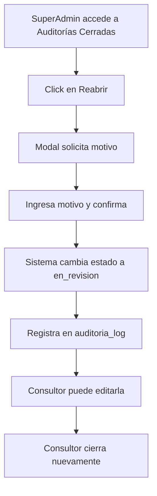
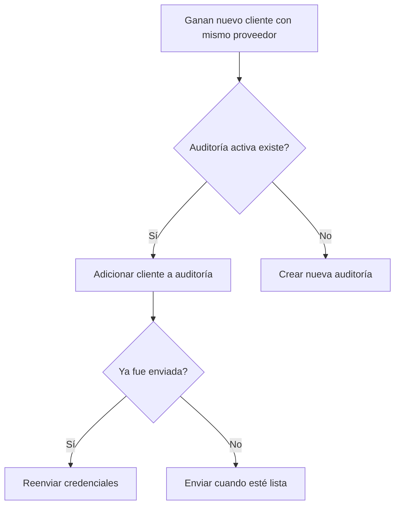
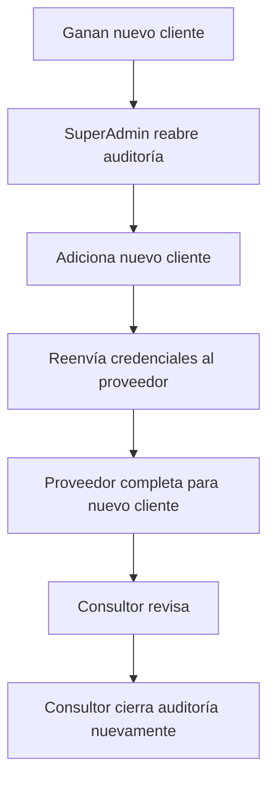

# Sistema de Reapertura y Gestión de Auditorías Cerradas

## 📋 Resumen

Se implementó un sistema completo para gestionar auditorías cerradas, permitiendo:
1. **Reabrir auditorías cerradas** (solo SuperAdmin)
2. **Adicionar clientes** a auditorías existentes
3. **Reenviar credenciales** al proveedor cuando se agregan nuevos clientes

---

## 🔐 Permisos

### SuperAdmin (rol 1)
- ✅ Reabrir auditorías cerradas
- ✅ Ver historial de reaperturas
- ✅ Adicionar clientes a cualquier auditoría
- ✅ Reenviar credenciales

### Consultor (rol 2)
- ❌ NO puede reabrir auditorías cerradas
- ✅ Puede adicionar clientes a SUS auditorías (no cerradas)
- ✅ Puede reenviar credenciales de SUS auditorías

### Proveedor (rol 3)
- ❌ Sin permisos sobre esta funcionalidad

---

## 🗄️ Base de Datos

### Nueva Tabla: `auditoria_log`

```sql
CREATE TABLE auditoria_log (
    id_auditoria_log INT(11) UNSIGNED AUTO_INCREMENT PRIMARY KEY,
    id_auditoria INT(11) UNSIGNED NOT NULL,
    id_usuario INT(11) UNSIGNED NOT NULL,
    accion VARCHAR(50) NOT NULL COMMENT 'reapertura, cierre, anulacion, etc',
    estado_anterior VARCHAR(50) NULL,
    estado_nuevo VARCHAR(50) NULL,
    motivo TEXT NULL,
    created_at DATETIME NULL,
    FOREIGN KEY (id_auditoria) REFERENCES auditorias(id_auditoria) ON DELETE CASCADE,
    FOREIGN KEY (id_usuario) REFERENCES users(id_users) ON DELETE CASCADE
);
```

**Propósito:** Registrar todas las reaperturas, cierres y cambios importantes de auditorías para trazabilidad.

---

## 🛣️ Rutas Implementadas

### Para SuperAdmin (`/admin/`)

| Método | Ruta | Acción | Descripción |
|--------|------|--------|-------------|
| GET | `auditorias/cerradas` | `cerradas()` | Vista de gestión de auditorías cerradas |
| POST | `auditorias/:id/reabrir` | `reabrir()` | Reabre una auditoría cerrada |
| GET | `auditorias/:id/adicionar-clientes` | `adicionarClientes()` | Vista para adicionar clientes |
| POST | `auditorias/:id/adicionar-clientes` | `procesarAdicionClientes()` | Procesa adición de clientes |
| POST | `auditorias/:id/reenviar-credenciales` | `reenviarCredenciales()` | Reenvía credenciales al proveedor |

### Para Consultor (`/consultor/`)

| Método | Ruta | Acción | Descripción |
|--------|------|--------|-------------|
| GET | `auditorias/:id/adicionar-clientes` | `adicionarClientes()` | Vista para adicionar clientes |
| POST | `auditorias/:id/adicionar-clientes` | `procesarAdicionClientes()` | Procesa adición de clientes |
| POST | `auditorias/:id/reenviar-credenciales` | `reenviarCredenciales()` | Reenvía credenciales al proveedor |

---

## 🔧 Funcionalidades Implementadas

### 1. Reapertura de Auditorías

**Archivo:** `app/Models/AuditoriaModel.php`
**Método:** `reabrirAuditoria()`

```php
public function reabrirAuditoria(int $idAuditoria, int $idUsuarioReapertura, ?string $motivo = null): array
```

**Lógica:**
- ✅ Valida que la auditoría exista
- ✅ Valida que esté en estado `cerrada`
- ✅ Cambia el estado a `en_revision`
- ✅ Registra la acción en `auditoria_log` con motivo
- ✅ Retorna resultado con mensaje

**Flujo:**
1. SuperAdmin accede a `/admin/auditorias/cerradas`
2. Ve lista de auditorías cerradas con botón "Reabrir"
3. Click en "Reabrir" abre modal solicitando motivo (obligatorio)
4. Al confirmar, se ejecuta la reapertura
5. Se registra en el log con usuario, fechas y motivo
6. La auditoría pasa a estado `en_revision`
7. El consultor asignado puede editarla nuevamente

---

### 2. Adicionar Clientes a Auditoría Existente

**Archivo:** `app/Models/AuditoriaModel.php`
**Método:** `adicionarClientes()`

```php
public function adicionarClientes(int $idAuditoria, array $clientesIds): array
```

**Lógica:**
- ✅ Valida que la auditoría exista
- ✅ Valida que NO esté anulada
- ✅ Obtiene clientes ya asignados
- ✅ Filtra solo clientes nuevos (no duplicados)
- ✅ Inserta en `auditoria_clientes`
- ✅ Retorna cantidad de clientes agregados

**Casos de Uso:**

#### Caso A: Auditoría Abierta + Nuevo Cliente
```
Estado: borrador / en_proveedor / en_revision
Acción: Adicionar clientes directamente
Resultado: Clientes agregados, auditoría sigue su flujo
```

#### Caso B: Auditoría Cerrada + Nuevo Cliente
```
Estado: cerrada
Acción:
  1. SuperAdmin reabre la auditoría
  2. Adiciona los nuevos clientes
  3. Reenvía credenciales al proveedor
  4. Consultor vuelve a cerrar cuando termine
```

---

### 3. Reenvío de Credenciales

**Archivo:** `app/Controllers/Admin/AuditoriasController.php`
**Método:** `reenviarCredenciales()`

**Lógica:**
- ✅ Obtiene la auditoría con clientes
- ✅ Busca el contrato para obtener usuario responsable del proveedor
- ✅ Genera nueva contraseña segura
- ✅ Actualiza `password_hash` del usuario
- ✅ Envía email con:
  - Nueva contraseña
  - Link de acceso
  - Lista actualizada de clientes
  - Items de la auditoría

**Cuándo usar:**
- Después de adicionar clientes a auditoría ya enviada
- Cuando el proveedor perdió sus credenciales
- Cuando se necesita notificar al proveedor de cambios

---

## 📊 Vistas Creadas

### 1. Vista de Gestión de Auditorías Cerradas
**Archivo:** `app/Views/admin/auditorias/cerradas.php`

**Características:**
- 📋 Tabla con auditorías cerradas (DataTables)
- 🔄 Botón "Reabrir" con modal de confirmación
- ➕ Botón "Adicionar" para agregar clientes
- 📜 Tab con historial de reaperturas
- 🔍 Información completa (proveedor, consultor, clientes, cumplimiento)

**Screenshot Conceptual:**
```
┌─────────────────────────────────────────────────┐
│ Auditorías Cerradas - Gestión          [Volver]│
├─────────────────────────────────────────────────┤
│ [Auditorías Cerradas] [Historial Reaperturas]  │
├──────────┬───────────┬──────────┬───────────────┤
│ Código   │ Proveedor │ Clientes │ Acciones      │
├──────────┼───────────┼──────────┼───────────────┤
│ AUD-001  │ Vigilancia│ 3        │[Reabrir][+]   │
│ v1.0     │ XYZ       │          │               │
└──────────┴───────────┴──────────┴───────────────┘
```

---

### 2. Vista de Adicionar Clientes
**Archivo:** `app/Views/admin/auditorias/adicionar_clientes.php`

**Características:**
- ℹ️ Información de la auditoría actual
- 👥 Lista de clientes actuales
- ✅ Checkboxes con clientes disponibles
- 🔘 Botón "Seleccionar Todos"
- 📧 Botón "Reenviar Credenciales" (si ya fue enviada)
- ⚠️ Alerta indicando que debe reenviar credenciales

**Screenshot Conceptual:**
```
┌─────────────────────────────────────────────────┐
│ Adicionar Clientes a Auditoría         [Volver]│
├─────────────────────────────────────────────────┤
│ Auditoría: AUD-001 | Proveedor: Vigilancia XYZ │
├─────────────────────────────────────────────────┤
│ ┌─────────────────┐ ┌─────────────────────────┐│
│ │ Info Auditoría  │ │ Clientes Actuales       ││
│ │ Estado: Cerrada │ │ ✓ Conjunto Los Pinos    ││
│ │ Consultor: Juan │ │ ✓ Torre Central         ││
│ └─────────────────┘ └─────────────────────────┘│
├─────────────────────────────────────────────────┤
│ Seleccionar Clientes para Adicionar:           │
│ ☐ Conjunto Residencial Las Acacias             │
│ ☐ Edificio El Parque                           │
├─────────────────────────────────────────────────┤
│ ⚠️ Esta auditoría ya fue enviada. Deberás      │
│    reenviar credenciales. [Reenviar Ahora]     │
└─────────────────────────────────────────────────┘
```

---

## 🔄 Flujos Completos

### Flujo 1: Reabrir Auditoría para Correcciones



### Flujo 2: Agregar Nuevo Cliente a Auditoría Activa



### Flujo 3: Agregar Cliente a Auditoría Cerrada



---

## 📝 Validaciones Implementadas

### Reapertura:
- ✅ Solo auditorías en estado `cerrada`
- ✅ Solo SuperAdmin puede ejecutar
- ✅ Motivo es obligatorio
- ✅ Se registra en log con trazabilidad

### Adicionar Clientes:
- ✅ Auditoría no puede estar anulada
- ✅ No duplicar clientes ya asignados
- ✅ Cliente debe pertenecer al mismo proveedor
- ✅ Al menos 1 cliente debe ser seleccionado

### Reenvío de Credenciales:
- ✅ Usuario responsable debe existir
- ✅ Usuario debe tener rol de proveedor
- ✅ Contrato debe estar activo
- ✅ Genera nueva contraseña segura
- ✅ Email debe enviarse correctamente

---

## 🎯 Respuestas a Preguntas Originales

### ❓ "¿Puedo simplemente adicionarlo en las relaciones o debo crear una auditoría nueva?"

**Respuesta:** Puedes adicionar en las relaciones existentes.

**Cuándo adicionar:**
- ✅ Mismo proveedor
- ✅ Mismo periodo de auditoría
- ✅ Auditoría aún no cerrada o reabierta por admin

**Cuándo crear nueva:**
- ❌ Periodo diferente
- ❌ Proveedor diferente
- ❌ Formato/versión diferente

---

### ❓ "¿Dependiendo de eso miramos el tema del reenvío de las credenciales?"

**Respuesta:** Sí, el reenvío depende del estado de la auditoría.

**Escenarios:**

1. **Auditoría en borrador (no enviada):**
   - Adicionar clientes
   - No reenviar (aún no se ha enviado la primera vez)
   - Enviar cuando esté lista con TODOS los clientes

2. **Auditoría ya enviada al proveedor:**
   - Adicionar clientes
   - **REENVIAR credenciales inmediatamente**
   - Notifica al proveedor los nuevos clientes

3. **Auditoría cerrada:**
   - SuperAdmin debe reabrir
   - Adicionar clientes
   - Reenviar credenciales
   - Consultor cierra cuando termine

---

## 🚀 Cómo Usar

### Para SuperAdmin:

1. **Ver auditorías cerradas:**
   ```
   Navegar a: /admin/auditorias/cerradas
   ```

2. **Reabrir auditoría:**
   ```
   Click en "Reabrir" → Ingresar motivo → Confirmar
   ```

3. **Adicionar clientes:**
   ```
   Click en "Adicionar" → Seleccionar clientes → Confirmar
   ```

4. **Reenviar credenciales:**
   ```
   En vista de adicionar clientes → Click "Reenviar Credenciales"
   ```

---

### Para Consultor:

1. **Adicionar clientes a SUS auditorías:**
   ```
   Desde vista de auditoría → Click "Adicionar Clientes"
   ```

2. **Reenviar credenciales:**
   ```
   Después de adicionar → Click "Reenviar Credenciales"
   ```

---

## 🔍 Testing

### Casos de Prueba:

#### Test 1: Reabrir Auditoría Cerrada
```
1. Login como SuperAdmin
2. Ir a /admin/auditorias/cerradas
3. Click "Reabrir" en auditoría
4. Ingresar motivo: "Agregar nuevo cliente"
5. Confirmar
6. Verificar estado cambia a "en_revision"
7. Verificar registro en auditoria_log
```

#### Test 2: Adicionar Cliente a Auditoría Enviada
```
1. Login como SuperAdmin
2. Ir a auditoría con fecha_envio_proveedor != null
3. Click "Adicionar Clientes"
4. Seleccionar nuevo cliente
5. Confirmar
6. Verificar cliente en auditoria_clientes
7. Click "Reenviar Credenciales"
8. Verificar email enviado
```

#### Test 3: Validación de Permisos
```
1. Login como Consultor
2. Intentar acceder a /admin/auditorias/cerradas
3. Verificar redirección con error "Acceso denegado"
```

---

## 📌 Notas Importantes

1. **Solo SuperAdmin puede reabrir auditorías cerradas** para mantener control de calidad
2. **Las reaperturas quedan registradas** en `auditoria_log` con motivo y usuario
3. **Reenvío de credenciales genera nueva contraseña** por seguridad
4. **No se pueden adicionar clientes a auditorías anuladas**
5. **El sistema detecta duplicados** al adicionar clientes
6. **Email se envía al usuario responsable** del proveedor (no al email genérico)

---

## 🎓 Mejores Prácticas

1. ✅ **Siempre ingresar motivo claro** al reabrir auditorías
2. ✅ **Reenviar credenciales inmediatamente** después de adicionar clientes
3. ✅ **Notificar al proveedor** por otro medio cuando se reenvían credenciales
4. ✅ **Cerrar auditoría lo antes posible** después de reabrirla
5. ✅ **Preferir adicionar a mismo proveedor** antes de crear nueva auditoría

---

## 🐛 Troubleshooting

### Problema: No puedo reabrir auditoría
**Solución:** Verificar que seas SuperAdmin (rol 1)

### Problema: No aparecen clientes para adicionar
**Solución:** Todos los clientes del proveedor ya están asignados

### Problema: Error al reenviar credenciales
**Solución:** Verificar que el contrato tenga usuario responsable con email

### Problema: Email no llega
**Solución:** Revisar configuración SendGrid en `.env`

---

## 📚 Archivos Modificados/Creados

```
app/
├── Models/
│   └── AuditoriaModel.php (+ reabrirAuditoria, adicionarClientes)
├── Controllers/
│   └── Admin/
│       └── AuditoriasController.php (+ cerradas, reabrir, adicionarClientes, etc)
├── Views/
│   └── admin/
│       └── auditorias/
│           ├── cerradas.php (NEW)
│           └── adicionar_clientes.php (NEW)
├── Config/
│   └── Routes.php (+ rutas de reapertura y adición)
└── Database/
    └── Migrations/
        └── 2025-11-10-135121_CreateAuditoriaLogTable.php (NEW)
```

---

## ✅ Checklist de Implementación

- [x] Tabla `auditoria_log` creada
- [x] Método `reabrirAuditoria()` implementado
- [x] Método `adicionarClientes()` implementado
- [x] Método `reenviarCredenciales()` implementado
- [x] Rutas configuradas para SuperAdmin
- [x] Rutas configuradas para Consultor
- [x] Vista de auditorías cerradas creada
- [x] Vista de adicionar clientes creada
- [x] Validaciones de permisos implementadas
- [x] Sistema de log funcionando
- [x] Documentación completa

---

**Fecha de implementación:** 2025-11-10
**Desarrollado con:** Claude Code
**Versión:** 1.0
